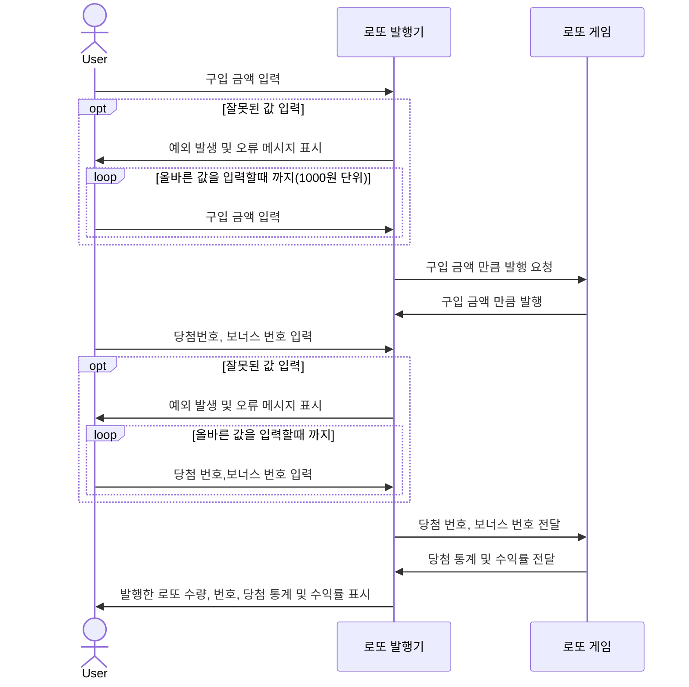
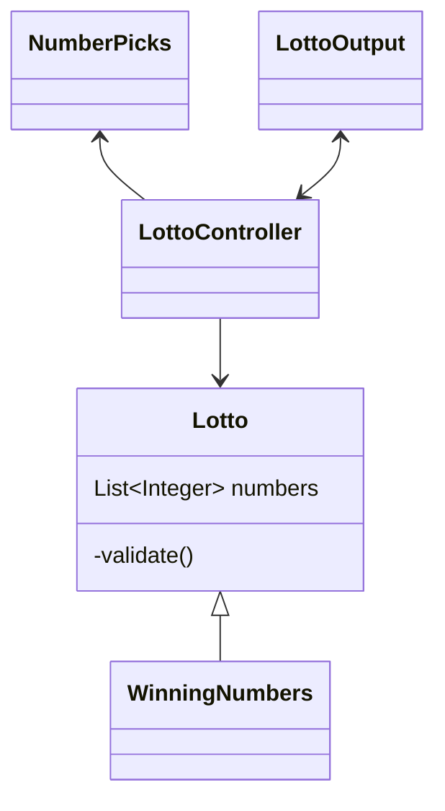

# java-lotto-precourse
***
## 구현해야 할 목록
### 로또 
~~숫자 범위 1-45~~  
~~중복되지 않는 6개의 숫자~~

### 로또 진행 순서 
당첨 번호 추첨 시 중복되지 않는 숫자 6개와 보너스 번호 1개를 뽑는다.  
당첨은 1등부터 5등까지 있다. 당첨 기준과 금액은 아래와 같다. 

1등: 6개 번호 일치 / 2,000,000,000원  
2등: 5개 번호 + 보너스 번호 일치 / 30,000,000원  
3등: 5개 번호 일치 / 1,500,000원  
4등: 4개 번호 일치 / 50,000원  
5등: 3개 번호 일치 / 5,000원  

### 로또 발행기
로또 구입 금액을 입력하면 구입 금액에 해당하는 만큼 로또를 발행해야 한다.  
그다음, 당첨 번호와 보너스 번호를 입력받는다.  
로또 1장의 가격은 1,000원이다.  
### 사용자 입력
사용자가 구매한 로또 번호와 당첨 번호를 비교하여 당첨 내역 및 수익률을 출력하고 로또 게임을 종료한다.  
사용자가 잘못된 값을 입력할 경우 IllegalArgumentException을 발생시키고,   
"[ERROR]"로 시작하는 에러 메시지를 출력 후 그 부분부터 입력을 다시 받는다.  

### 사용자 정의 예외 클래스
사용자 입력 exception handling때 쓰임.  <- lotto class랑의 error handling이랑 통일하는게 좋을지도?

***
## Sequence Diagram
# 주의! 확정 아님 

## Class Diagram
# 주의! 확정 아님
winning number랑 picks랑 strategy로 구현할수도??
